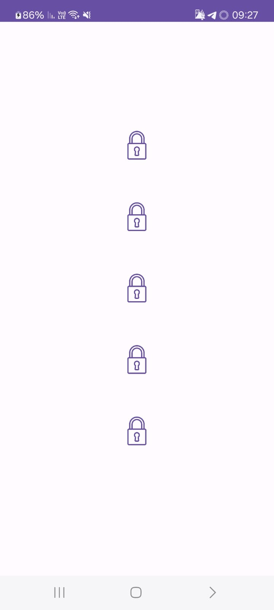
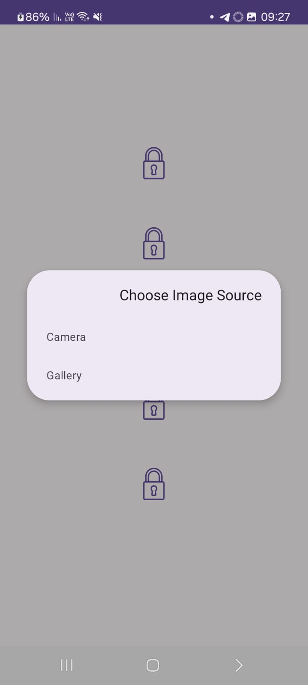
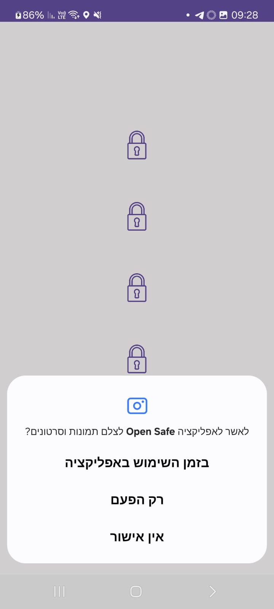
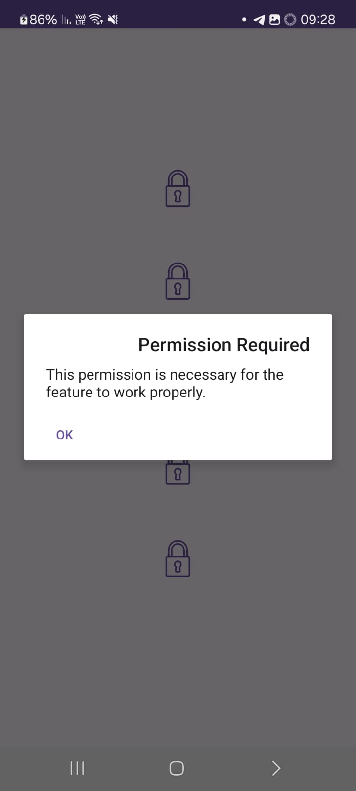
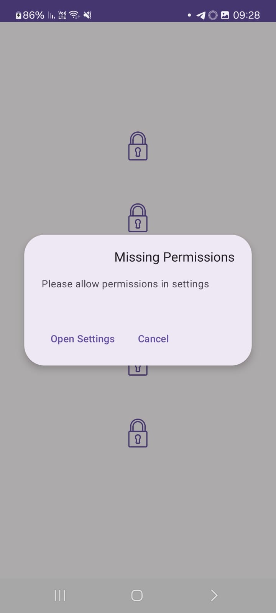
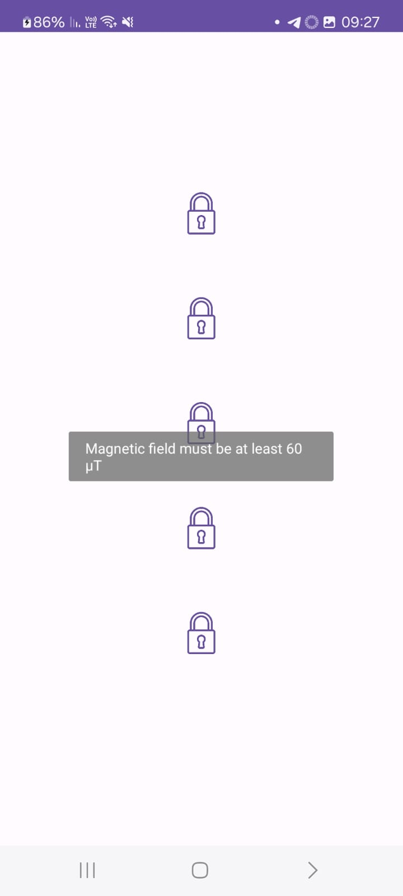
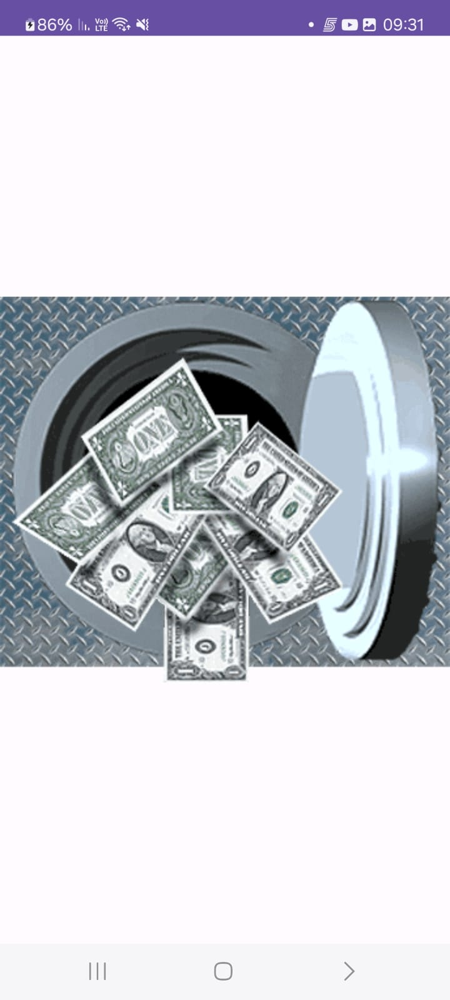

# 🔐 OPEN_SAFE


Welcome to **OPEN_SAFE**, the ultimate challenge-based unlocking app!  
Your mission: **complete 5 tasks to unlock each lock** and gain access to the **final safe**.  

## 🚀 Features
- 🔒 **5 unique locks**, each requiring a specific task to open.
- 📌 **Long press any lock** for detailed instructions.
- ⚙️ **Smart permission handling** – Ensures smooth interaction and guides users when denied permissions.
- 🎨 **Interactive UI with real-time feedback**.

## 🔑 How to Unlock Each Lock?
| 🔒 Lock | 🏆 Unlock Requirement |
|---------|----------------------|
| 🔵 **Bluetooth Lock** | Connect any Bluetooth device to the phone. |
| 🍽️ **Food Image Lock** | Take a picture of food or select a food image from the gallery. |
| 📞 **Contacts Lock** | Add a new contact to the phone. |
| 🎛️ **Magnetic Field Lock** | Detect a **magnetic field of 60 µT or higher**. |
| 🏷️ **NFC Lock** | Scan any **NFC tag** using the device. |

🔹 **Gallery or Camera Selection Example:**



## ⚙️ **Permission Handling**


To ensure a smooth experience, **OPEN_SAFE** handles permissions intelligently:
1. If a permission is **denied once**, a **friendly message** explains why it's needed.


2. If the permission is **denied twice**, the app directs the user to **device settings** for manual activation.


## 🎮 How to Play


1️⃣ **Launch OPEN_SAFE** to see the 5 locks on the main screen.  
2️⃣ **Long-press any lock** to get instructions on how to unlock it.  
3️⃣ **Complete the challenge** for each lock using the required method:  
   - 🔵 Connect **Bluetooth**  
   - 🍽️ Take or select a **food image**  
   - 📞 Add a **new contact**  
   - 🎛️ Detect **magnetic field of 60 µT or higher**  
   - 🏷️ Scan an **NFC tag**
     
4️⃣ **Once all locks are unlocked, the safe will open automatically!**



## 📦 Installation
```bash
git clone https://github.com/Avichai98/open_safe.git
cd open_safe
```
# 🛠️ Technologies Used

## 💻 Languages
- JAVA  
- XML  

## 📱 SDK
- Android SDK  

## 📚 Libraries  
- [Google ML Kit](https://developers.google.com/ml-kit)  
- [Glide](https://github.com/bumptech/glide)

## 📩 Contact

If you have any questions, suggestions, or want to contribute, feel free to reach out.

## 📧 Email  
📌 [avichai.shchori@gmail.com](mailto:avichai.shchori@gmail.com)  

## 💼 LinkedIn  
📌 [LinkedIn Profile](https://www.linkedin.com/in/avichai-shchori-995832277)
